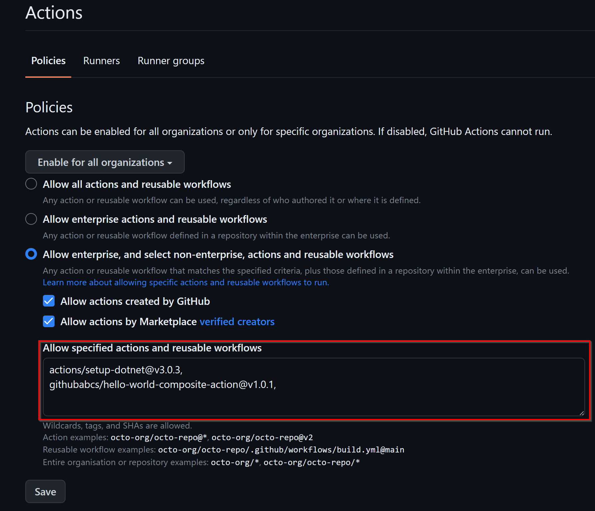

# Migration Plan v2.0 - DRAFT

- [Migration Plan v2.0 - DRAFT](#migration-plan-v20---draft)
  - [Prerequisites](#prerequisites)
  - [Scope of the migration](#scope-of-the-migration)
  - [Step 1: Install Git for Windows](#step-1-install-git-for-windows)
  - [Step 2: Install PowerShell 7.3.0](#step-2-install-powershell-730)
  - [Step 3: Install GitHub CLI](#step-3-install-github-cli)
    - [Winget](#winget)
    - [Signed MSI](#signed-msi)
  - [Step 4: Install the GitHub Enterprise Importer (GEI) extension of the GitHub CLI](#step-4-install-the-github-enterprise-importer-gei-extension-of-the-github-cli)
  - [Step 5: Install the PSSodium module for PowerShell](#step-5-install-the-pssodium-module-for-powershell)
  - [Step 6: Clone this Repository](#step-6-clone-this-repository)
  - [Step 7: Set environment variables](#step-7-set-environment-variables)
  - [Step 8: Fetch the list of GitHub Actions in use by the source organization](#step-8-fetch-the-list-of-github-actions-in-use-by-the-source-organization)
  - [Step 9: Generate the list of allowed GitHub Actions in use by the target organization](#step-9-generate-the-list-of-allowed-github-actions-in-use-by-the-target-organization)
  - [Step 10: Create a slug mapping file for users in the source organization](#step-10-create-a-slug-mapping-file-for-users-in-the-source-organization)
  - [Step 11: Get the list of repositories in the source organization](#step-11-get-the-list-of-repositories-in-the-source-organization)
  - [Step 12: Migrate your repositories](#step-12-migrate-your-repositories)
  - [Step 13: Migrate your teams](#step-13-migrate-your-teams)
  - [Step 14: Migrate your repository and environment secrets](#step-14-migrate-your-repository-and-environment-secrets)
  - [Step 15: Reclaim mannequins](#step-15-reclaim-mannequins)
  - [Step 16: Post-migration checks](#step-16-post-migration-checks)
  - [Appendix](#appendix)
    - [Create Personal Access Tokens](#create-personal-access-tokens)
    - [Authorizing a personal access token for use with SAML single sign-on](#authorizing-a-personal-access-token-for-use-with-saml-single-sign-on)
    - [Changing a remote repository's URL](#changing-a-remote-repositorys-url)

## Prerequisites

1. To migrate an organization, you must be an organization owner for the **source organization**. Additionally, you must be an **enterprise owner on the destination enterprise** account

## Scope of the migration

The following items will be migrated from the source organization to the destination organization:

- Repositories and their contents (including issues, pull requests, releases, wikis, etc.)
- Teams, team members and team permissions
- Organization, repository and environment secrets

Anything not explicitly listed above **will not** be migrated, *including but not limited to*:

- GitHub Apps
- GitHub Packages
- Projects
- Discussions
- Webhooks
- SSH keys

## Step 1: Install Git for Windows

1. Download and install [Git for Windows](https://github.com/git-for-windows/git/releases/download/v2.38.1.windows.1/Git-2.38.1-64-bit.exe)
2. Once installed, Git is available from the command prompt or PowerShell

> It's recommended that you select the defaults during installation unless there's good reason to change them

## Step 2: Install PowerShell 7.3.0

To install PowerShell on Windows, use the following links to download the install package from GitHub.

1. [PowerShell-7.3.0-win-x64.msi](https://github.com/PowerShell/PowerShell/releases/download/v7.3.0/PowerShell-7.3.0-win-x64.msi)

## Step 3: Install GitHub CLI

### Winget

| Install                          | Upgrade                          |
|:--------------------------------:|:--------------------------------:|
| `winget install --id GitHub.cli` | `winget upgrade --id GitHub.cli` |

### Signed MSI

MSI installers are available for download on the [releases page](https://github.com/cli/cli/releases/latest).

## Step 4: Install the GitHub Enterprise Importer (GEI) extension of the GitHub CLI

> If you have previously installed the GEI extension, you must upgrade to the latest version before you can use it to migrate to GitHub Enterprise Cloud.

| Install                              | Upgrade                              |
|:------------------------------------:|:------------------------------------:|
| `gh extension install github/gh-gei` | `gh extension upgrade github/gh-gei` |

## Step 5: Install the PSSodium module for PowerShell

1. Open PowerShell (recommend opening with elevated Admin permissions)
2. Type `Install-Module -Name PSSodium -Scope CurrentUser -Force -SkipPublisherCheck`

    ```posh
    Install-Module -Name PSSodium -Scope CurrentUser -Force -SkipPublisherCheck
    ```

## Step 6: Clone this Repository

1. Open PowerShell (recommend opening with elevated Admin permissions)
2. Change the current working directory to the location where you want the cloned directory.
3. Type `git clone https://github.com/martins-vds/gh-migration-scripts`

    ```posh
    git clone https://github.com/martins-vds/gh-migration-scripts
    ```

4. Press Enter to create your local clone.

## Step 7: Set environment variables

Before you can use the GEI extension to migrate to GitHub Enterprise Cloud, you must create personal access tokens (classic) that can access the source organization and destination enterprise, then set the personal access tokens (classic) as environment variables.

> See [**Appendix: Create Personal Access Tokens**](#create-personal-access-tokens) for instructions

1. Create and record a personal access token that meets all the requirements to authenticate for the
source organization for organization migrations.

2. Create and record a personal access token (classic) that meets all the requirements to authenticate for the destination enterprise for organization migrations.

3. Set environment variables for the personal access tokens (classic), replacing **TOKEN** in the commands below with the personal access tokens (classic) you recorded above. Use GH_PAT for the destination enterprise and GH_SOURCE_PAT for the source organization.
   - Using PowerShell, use the `$env` command.

    ```posh
    [Environment]::SetEnvironmentVariable("GH_SOURCE_PAT", "TOKEN", [EnvironmentVariableTarget]::User);
    [Environment]::SetEnvironmentVariable("GH_PAT", "TOKEN", [EnvironmentVariableTarget]::User);
    ```

4. Close and reopen PowerShell (recommend opening with elevated Admin permissions) to ensure the GH_PAT and GH_SOURCE_PAT environment variables are updated and available.

## Step 8: Fetch the list of GitHub Actions in use by the source organization

> Note: Before running this script, make sure that all the repositories in the source organization have the Dependency Graph enabled. Otherwise, the script will not be able to fetch a complete list of GitHub Actions in use by the source organization. For more information, see [**Configuring the dependency graph**](https://docs.github.com/en/code-security/supply-chain-security/understanding-your-software-supply-chain/configuring-the-dependency-graph)

To fetch the list of GitHub Actions in use by the source organization, run the script `get-org-actions.ps1`:

```posh
.\scripts\get-org-actions.ps1 -org <SOURCE> -OutputFile .\actions.csv
```

Replace the placeholders in the command above with the following values.

|Placeholder|Value|
|-----------|-----|
|SOURCE|Name of the source organization|

Once the script has completed, you will have a CSV file with a list of GitHub Actions in use by the source organization. You must review this list and determine which GitHub Actions you want to allow in the destination organization by updating the `is_allowed` column in the CSV file.

## Step 9: Generate the list of allowed GitHub Actions in use by the target organization

To generate the list of allowed GitHub Actions in use by the target organization, run the script `create-actions-allow-list`:

> Note: This script uses the `actions.csv` file generated in the previous step

```posh
.\scripts\create-actions-allow-list.ps1 -ActionsFile .\actions.csv
```

Copy the output of the script and paste it into the allow-list in the GitHub enterprise/organization settings page for the destination organization. The link to the allow-list is: <https://github.com/enterprises/DESTINATION/settings/actions>. Replace `DESTINATION` with the destination enterprise.



## Step 10: Create a slug mapping file for users in the source organization

To create a slug mapping file for users in the source organization, run the script `create-slug-mapping-file.ps1`:

```posh
.\scripts\create-slug-mapping-file.ps1 -Org <SOURCE> -OutputFile .\slug-mapping.csv
```

Replace the placeholders in the command above with the following values.

|Placeholder|Value|
|-----------|-----|
|SOURCE|Name of the source organization|

Once the script has completed, you will have a CSV file with a list of users in the source organization. You must review this list and update the `slug_target_org` column in the CSV file with the username of the user in the destination organization.

## Step 11: Get the list of repositories in the source organization

To get the list of repositories in the source organization, run the script `get-repos.ps1`:

```posh
.\scripts\get-repos.ps1 -Org <SOURCE> -OutputFile .\repos.csv
```

Replace the placeholders in the command above with the following values.

|Placeholder|Value|
|-----------|-----|
|SOURCE|Name of the source organization|

Once the script has completed, you will have a CSV file with a list of repositories in the source organization. You must review this list and determine which repositories you want to migrate to the destination organization by removing the repositories you don't want to migrate from the CSV file.

## Step 12: Migrate your repositories

To migrate repositories, run the script `migrate-repos.ps1`:

```posh
.\scripts\migrate-repos.ps1 -SourceOrg <SOURCE> -TargetOrg <DESTINATION> -ReposFile .\repos.csv -Parallel 5 -ArchiveSourceRepos
```

Replace the placeholders in the command above with the following values.

|Placeholder|Value|
|-----------|-----|
|SOURCE|Name of the source organization|
|DESTINATION|Name of the destination organization. It must be created before running this script.|

This step can take a long time to complete depending on the number of repositories you are migrating. You can use the `--parallel` flag to specify the number of repositories to migrate in parallel. The default is `5`.

> Note: After the repositories have been migrated, anyone who has cloned the repositories from the source organization must update their local repositories to point to the new location in the destination organization. For more information, see [Appendix: Changing a remote repository's URL](#changing-a-remote-repositorys-url)

## Step 13: Migrate your teams

> Note: This script uses the `slug-mapping.csv` file generated in step [**Step 10: Create a slug mapping file for users in the source organization**](#step-10-create-a-slug-mapping-file-for-users-in-the-source-organization)

To migrate teams, run the script `migrate-teams.ps1`:

```posh
# If you want to add team members to the destination organization, run the script with the -AddTeamMembers flag
.\scripts\migrate-teams.ps1 -SourceOrg <SOURCE> -TargetOrg <DESTINATION> -SlugMappingFile .\slug-mapping.csv -SkipEmptySlugMappings [-AddTeamMembers]
```

Replace the placeholders in the command above with the following values:

|Placeholder|Value|
|-----------|-----|
|SOURCE|Name of the source organization|
|DESTINATION|The name you want the new organization to have. Must be unique on GitHub.com|

> Note: Make sure that user access is managed by using teams in the source organization. If you have users with direct access to repositories, you must remove them from the repositories and add them to the appropriate teams in the source organization before migrating.

## Step 14: Migrate your repository and environment secrets

> Note: If you don't own the repositories in the source organization, you must ask the repository owners to export the repository secrets and send them to you. You can then import the repository secrets in the destination organization.

1. Export the repository secrets for each repository in the source organization which you want to migrate following the instructions in [**Exporting repository secrets**](https://github.com/martins-vds/export-secrets-action).
   - This is a custom GitHub Action that you must add to each repository in the source organization which you want to migrate.
   - It will export the secrets to a CSV file and upload it to GitHub as an artifact.
   - Download the CSV file from the artifact for each repository in the source organization which you want to migrate.
   - If you exported secrets for multiple repositories, you can merge the CSV files into a single CSV file by running the script `merge-csv-files.ps1`:

      ```posh
      .\scripts\merge-csv-files.ps1 -Path <FOLDER_CONTAINING_CSV_SECRET_FILES> -OutputFile .\secrets.csv
      ```

   - If you **don't want** to migrate repository secrets using scripts, you can **skip the next step** and manually add the secrets to the destination organization.

      > Note: Secrets values in the CSV file might have been escaped with double quotes in order to not break the CSV format. You must remove any extra double quotes from the secret values before adding them to the destination organization.

2. (Optional) Import the repository secrets for each repository in the destination organization which you want to migrate by running the script `migrate-repo-secrets.ps1`:

    ```posh
    .\scripts\migrate-repo-secrets.ps1 -SourceOrg <SOURCE> -TargetOrg <DESTINATION> -ReposFile .\repos.csv -SecretsFile .\secrets.csv
    ```

    Replace the placeholders in the command above with the following values.

    |Placeholder|Value|
    |-----------|-----|
    |SOURCE|Name of the source organization|
    |DESTINATION|The name you want the new organization to have. Must be unique on GitHub.com|

  This script will import the repository secrets for each repository in the destination organization which you want to migrate. If a secret is not found in the CSV file, a default value `CHANGE_ME` will be used.

## Step 15: Reclaim mannequins

1. Optionally, to reclaim mannequins in bulk, create a CSV file that maps mannequins to organization members.

   - To generate a CSV file with a list of mannequins for an organization, use the `gh gei generate-mannequin-csv` command, replacing `DESTINATION` with the destination organization and `FILENAME` with a file name for the resulting CSV file.

   Optionally, to include mannequins that have already been reclaimed, add the `--include-reclaimed` flag

    ```posh
    gh gei generate-mannequin-csv --github-target-org DESTINATION --output FILENAME.csv
    ```

    - Edit the CSV file, adding the username of the organization member that corresponds to each mannequin.

    - Save the file.

2. To reclaim mannequins, use the gh gei reclaim-mannequin command.

    - To reclaim mannequins in bulk with the mapping file you created earlier, replace `DESTINATION` with the destination organization and `FILENAME` with the file name of the mapping file.

    ```posh
    gh gei reclaim-mannequin --github-target-org DESTINATION --csv FILENAME.csv
    ```

    - To reclaim an individual mannequin, replace `DESTINATION` with the `destination` organization, MANNEQUIN with the login of mannequin, and USERNAME with the username of the organization member that corresponds to the mannequin.

    If there are multiple mannequins with the same login, you can replace `--mannequin-user MANNEQUIN` with `--mannequin-ID ID`, replacing ID with the `ID` of the mannequin.

    ```posh
    gh gei reclaim-mannequin --github-target-org DESTINATION --mannequin-user MANNEQUIN --target-user USERNAME
    ```

3. The organization member will receive an invitation via email, and the mannequin will not be reclaimed until the member accepts the invitation.

## Step 16: Post-migration checks

1. Check if all the repositories have been migrated
   - If there are missing repositories in the destination organization, check the repositories file and confirm that the all the repositories you want to migrate are listed in the file
   - If there are submodules in the repositories, check if the submodules have been migrated and then update the submodule URLs in the repositories
2. Check if all the teams have been migrated and the members have been added to the teams
   - If users are missing from the teams, check the slug mapping file and confirm that all the users are listed in the file
3. Check if teams have been added to the repositories and their permissions have been set correctly
4. Check if all the repository secrets have been migrated
5. Check if workflows are running correctly
   - If workflows are failing with the error `Resource not accessible by integration`, check the job permissions for the workflows and confirm that the workflows have the correct permissions to access the resources. For more information, see [**Permissions for GitHub Actions**](https://docs.github.com/en/actions/using-workflows/workflow-syntax-for-github-actions#permissions)
   - If workflows are failing with the error `<ACTION> is not allowed to be used in <ORGANIZATION>/<REPOSITORY>`, check the allow-list and confirm that the GitHub Actions in use by the source organization are allowed in the destination organization. For more information, see [**Step 9: Generate the list of allowed GitHub Actions in use by the target organization**](#step-9-generate-the-list-of-allowed-github-actions-in-use-by-the-target-organization)

---

## Appendix

### Create Personal Access Tokens

1. In the upper-right corner of any page, click your profile photo, then click `Settings`.
2. In the left sidebar, click `<> Developer settings`.
3. In the left sidebar, under `Personal access tokens`, click `Tokens (classic)`.
4. Select `Generate new token`, then click `Generate new token (classic)`.
5. Give your token a descriptive name.
6. To give your token an expiration, select the `Expiration` drop-down menu, then click a default or use the calendar picker.
7. Select the scopes below
   - `repo`
   - `workflow`
   - `write:packages`
   - `delete:packages`
   - `admin:org`
   - `read:org`
   - `read:enterprise`
   - `delete_repo`
8. Click `Generate token`.
9. Copy the token and save it for later
10. If your organization requires SAML single sign-on for authentication, you must authorize your personal access token for use with SAML single sign-on. For more information, see [**Authorizing a personal access token for use with SAML single sign-on**](#authorizing-a-personal-access-token-for-use-with-saml-single-sign-on).

### Authorizing a personal access token for use with SAML single sign-on

1. In the upper-right corner of any page, click your profile photo, then click `Settings`.
2. In the left sidebar, click `Developer settings`.
3. In the left sidebar, click `Personal access tokens`.
4. Next to the token you'd like to authorize, click `Configure SSO`. If you don't see Configure SSO, ensure that you have authenticated at least once through your SAML IdP to access resources on GitHub.com
5. In the dropdown menu, to the right of the organization you'd like to authorize the token for, click `Authorize`.

### Changing a remote repository's URL

1. Open any command line interface (CLI) and navigate to the local repository you want to work with.
2. List your existing remotes in order to get the name of the remote you want to change.

    ```posh
    git remote -v
    ```

3. Change your remote's URL with the new URL for the remote repository.

    ```posh
    git remote set-url <REMOTE_NAME> <REMOTE_URL>
    ```

    Replace `<REMOTE_NAME>` with the name of the remote you want to change (for example, `origin`). Replace `<REMOTE_URL>` with the new URL you want to use for your remote repository.
